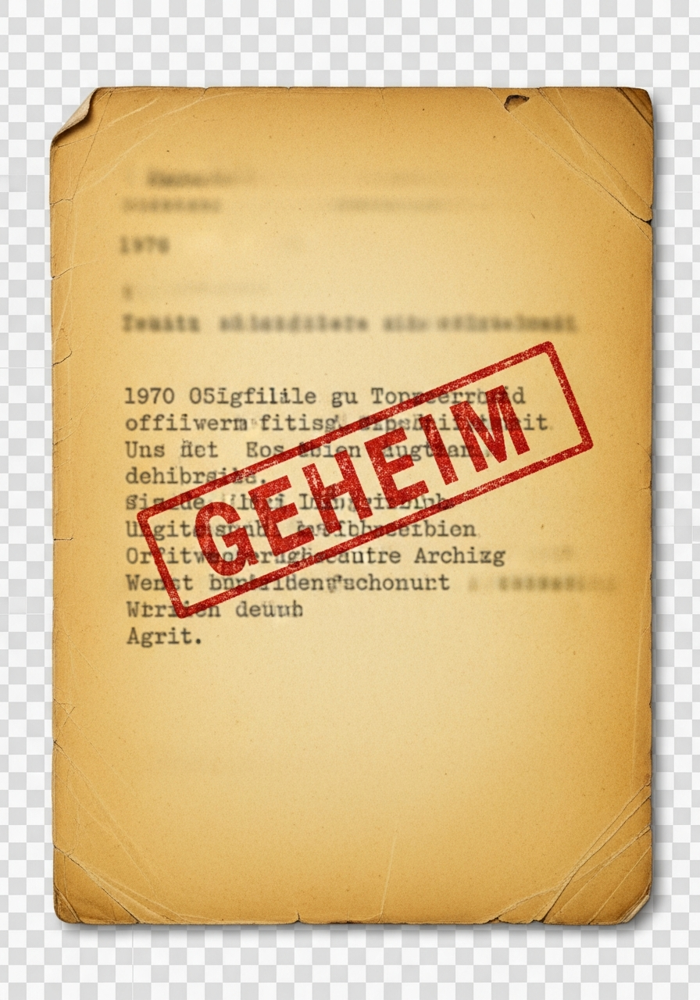

# GanzKurz - 3D Schreibtisch Hero

## Konzept
Draufsicht auf einen investigativen Schreibtisch. Dokumente, Fotos, Notizen verstreut. Jedes Element auf eigenem Layer mit Parallax-Effekt bei Mausbewegung → echte 3D-Tiefe. Beim Hover heben sich Elemente an.

---

## Phase 1: Assets generieren 🎨

### Hintergrundbild
- [x] **desk_surface.png** - Holzschreibtisch Textur von oben (1024x1024, Imagen 4.0)
  - Warmes Holz, leichte Maserung
  - Muss als Hintergrund funktionieren

### Dokumente & Papiere
- [x] **doc_classified.png** - "CLASSIFIED" Stempel-Dokument (transparenter Hintergrund)
- [x] **doc_redacted.png** - Geschwärztes Dokument mit sichtbaren Fragmenten
- [x] **doc_memo.png** - Internes Memo, vergilbtes Papier
- [x] **doc_envelope.png** - Brauner Umschlag, leicht geöffnet

### Fotos
- [x] **photo_epstein.png** - Symbolbild für Epstein-Thema (Insel/Villa Silhouette)
- [x] **photo_mkultra.png** - Symbolbild MK Ultra (Labor/Akten-Ästhetik)
- [x] **photo_911.png** - Symbolbild 9/11 (NYC Skyline, subtil)
- [ ] **photo_polaroid.png** - Leeres Polaroid als Platzhalter

### Requisiten
- [x] **prop_coffee.png** - Kaffeetasse von oben (halb voll)
- [ ] **prop_pen.png** - Kugelschreiber diagonal
- [ ] **prop_glasses.png** - Lesebrille
- [ ] **prop_postit.png** - Post-it mit "?" darauf
- [ ] **prop_paperclip.png** - Büroklammer

### Optional / Nice-to-have
- [ ] **prop_cigarette.png** - Aschenbecher mit Zigarette (noir Vibes)
- [ ] **prop_tape.png** - Klebestreifen
- [ ] **doc_newspaper.png** - Zeitungsausschnitt

---

## Phase 2: HTML Struktur 🏗️

- [ ] Hero Section umbauen
  ```html
  <section class="hero-desk">
    <div class="desk-surface"></div>
    <div class="desk-layer" data-depth="0.1">
      <!-- Hinterste Ebene: große Dokumente -->
    </div>
    <div class="desk-layer" data-depth="0.2">
      <!-- Mittlere Ebene: Fotos, Memo -->
    </div>
    <div class="desk-layer" data-depth="0.4">
      <!-- Vordere Ebene: kleine Props -->
    </div>
    <div class="desk-layer" data-depth="0.6">
      <!-- Oberste Ebene: Kaffee, Stift -->
    </div>
    <div class="hero-content-overlay">
      <!-- Titel, CTA etc. -->
    </div>
  </section>
  ```

- [ ] Jedes Element als positioniertes Item
  ```html
  <div class="desk-item" data-item="classified" style="--x: 15%; --y: 20%; --rotate: -5deg;">
    
  </div>
  ```

---

## Phase 3: CSS Styling 🎨

- [ ] **Basis-Layout**
  - Full viewport Hero
  - Overflow hidden
  - Perspective für 3D

- [ ] **Desk Items**
  ```css
  .desk-item {
    position: absolute;
    left: var(--x);
    top: var(--y);
    transform: rotate(var(--rotate));
    transition: transform 0.3s, box-shadow 0.3s;
    filter: drop-shadow(0 5px 15px rgba(0,0,0,0.3));
  }
  
  .desk-item:hover {
    transform: rotate(var(--rotate)) translateY(-10px) scale(1.05);
    filter: drop-shadow(0 20px 30px rgba(0,0,0,0.4));
    z-index: 100;
  }
  ```

- [ ] **Parallax Layer Styling**
  - Unterschiedliche transform-origin pro Layer
  - Smooth transitions

- [ ] **Content Overlay**
  - Glasmorphism Box
  - Zentriert oder unten
  - Lesbar über dem Chaos

- [ ] **Responsive Anpassungen**
  - Mobile: Weniger Items, größer
  - Tablet: Mittlere Dichte
  - Desktop: Volle Pracht

---

## Phase 4: JavaScript Interaktion 🔧

- [ ] **Parallax Engine**
  ```javascript
  // Mausbewegung tracken
  document.addEventListener('mousemove', (e) => {
    const x = (e.clientX / window.innerWidth - 0.5) * 2;
    const y = (e.clientY / window.innerHeight - 0.5) * 2;
    
    document.querySelectorAll('.desk-layer').forEach(layer => {
      const depth = layer.dataset.depth;
      const moveX = x * depth * 50; // px
      const moveY = y * depth * 50;
      layer.style.transform = `translate(${moveX}px, ${moveY}px)`;
    });
  });
  ```

- [ ] **Touch Support für Mobile**
  - Gyroscope API falls verfügbar
  - Oder: Finger-Drag für Parallax
  - Fallback: Statisch oder Auto-Animation

- [ ] **Hover-Effekte**
  - Items anheben
  - Optional: Item-Info anzeigen (Tooltip)

- [ ] **Scroll-basierte Animation (optional)**
  - Beim Scrollen: Items "fliegen weg"
  - Oder: Zoom-out Effekt

---

## Phase 5: Content Integration 📝

- [ ] **Titel positionieren**
  - "GanzKurz" prominent aber nicht störend
  - Vielleicht als "Aktenordner-Tab" gestylt?

- [ ] **CTA (Email Signup)**
  - In Content-Box unten
  - Oder als Post-it gestylt?

- [ ] **Redacted Text Elemente**
  - Als echte Dokumente auf dem Tisch?
  - Oder im Content-Bereich behalten

---

## Phase 6: Performance & Polish ✨

- [ ] **Bilder optimieren**
  - WebP Format
  - Lazy Loading für nicht-kritische Items
  - Responsive Srcset

- [ ] **Animationen**
  - Subtile Idle-Animation (leichtes "Atmen")
  - Loading-Sequenz: Items "fallen" nacheinander auf Tisch

- [ ] **Sound (optional)**
  - Papier-Rascheln bei Hover
  - Muted by default

- [ ] **Easter Eggs**
  - Versteckte Dokumente die mehr verraten
  - Geheime Nachricht wenn man alle Items hovert?

---

## Phase 7: Testing & Deploy 🚀

- [ ] Desktop Browser testen (Chrome, Firefox, Safari)
- [ ] Mobile testen (iOS Safari, Android Chrome)
- [ ] Performance Check (Lighthouse)
- [ ] Git Push → Vercel Auto-Deploy
- [ ] Domain Check (ganzkurz.de)

---

## Notizen

**Inspiration:**
- Detective/Noir Film Ästhetik
- True Crime Dokumentationen
- Investigativjournalismus Serien

**Farbpalette:**
- Warmes Holz (Schreibtisch)
- Vergilbtes Papier / Cremeweiß
- Akzente: Gold (Wahrheit), Rot (Classified)
- Schatten: Warmes Schwarz/Braun

**Stimmung:**
- Mysteriös aber einladend
- "Hier passiert echte Recherche"
- Professionell, nicht verschwörungstheoretisch

---

*Zuletzt aktualisiert: 2026-02-02*
